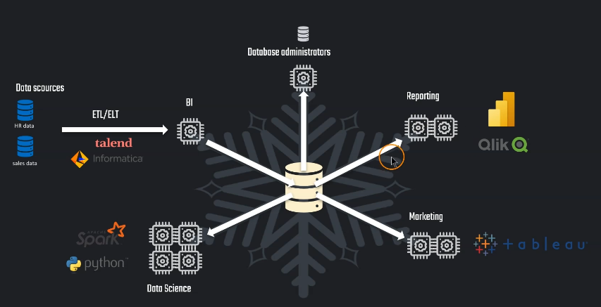
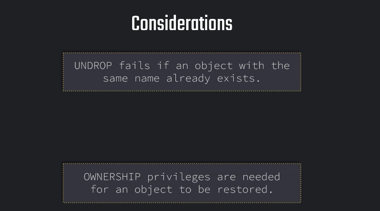
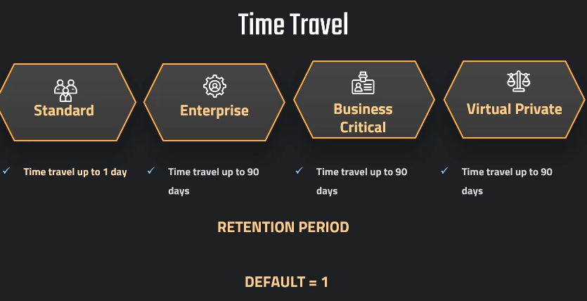

# Snowflake Time Travel

## Overview
This document provides a step-by-step guide on how to use Snowflake's Time Travel feature. Time Travel allows you to access historical data by querying data as it was at a previous point in time. This is useful for recovering data that has been modified or deleted, auditing changes, and analyzing historical trends. We will cover setting up tables, using various time travel methods, restoring data, and managing retention periods and costs.

## Index
- [Introduction to Time Travel](#introduction-to-time-travel)
- [Setting up Tables and Stages](#setting-up-tables-and-stages)
- [Using Time Travel](#using-time-travel)
  - [Method 1: Using OFFSET](#method-1-using-offset)
  - [Method 2: Using Timestamp](#method-2-using-timestamp)
  - [Method 3: Using Query ID](#method-3-using-query-id)
- [Restoring Data](#restoring-data)
  - [Bad Method](#bad-method)
  - [Good Method](#good-method)
- [Retention Periods](#retention-periods)
- [Time Travel Costs](#time-travel-costs)
- [Conclusion](#conclusion)

---

## Introduction to Time Travel
Snowflake Time Travel enables you to query data as it existed at a previous point in time. It provides three methods:
1. **OFFSET**: Access data from a relative time in the past.
2. **TIMESTAMP**: Retrieve data as it was at a specific timestamp.
3. **QUERY ID**: View data before a specific query was executed.

This feature is useful for recovering from accidental changes, auditing data changes, and analyzing historical data trends.




---

## Setting up Tables and Stages

-- Setting up table

```sql
CREATE OR REPLACE TABLE OUR_FIRST_DB.public.test (
   id int,
   first_name string,
  last_name string,
  email string,
  gender string,
  Job string,
  Phone string);
```  
    
```sql
CREATE OR REPLACE FILE FORMAT MANAGE_DB.file_formats.csv_file
    type = csv
    field_delimiter = ','
    skip_header = 1;
```

```sql    
CREATE OR REPLACE STAGE MANAGE_DB.external_stages.time_travel_stage
    URL = 's3://data-snowflake-fundamentals/time-travel/'
    file_format = MANAGE_DB.file_formats.csv_file;
```    

```sql
LIST @MANAGE_DB.external_stages.time_travel_stage;
```

```sql
COPY INTO OUR_FIRST_DB.public.test
from @MANAGE_DB.external_stages.time_travel_stage
files = ('customers.csv');
```

```sql
SELECT * FROM OUR_FIRST_DB.public.test;
```

-- Use-case: Update data (by mistake)

```sql
UPDATE OUR_FIRST_DB.public.test
SET FIRST_NAME = 'Joyen' ;
```


###  Method 1: Using OFFSET

```sql
SELECT * FROM OUR_FIRST_DB.public.test at (OFFSET => -60*1.5);
```

### Method 2: Using Timestamp
```sql
SELECT * FROM OUR_FIRST_DB.public.test before (timestamp => '2021-04-15 17:47:50.581'::timestamp);
```

-- Setting up table
```sql
CREATE OR REPLACE TABLE OUR_FIRST_DB.public.test (
   id int,
   first_name string,
  last_name string,
  email string,
  gender string,
  Job string,
  Phone string);

COPY INTO OUR_FIRST_DB.public.test
from @MANAGE_DB.external_stages.time_travel_stage
files = ('customers.csv');


SELECT * FROM OUR_FIRST_DB.public.test;
```

-- 2021-04-17 08:16:24.259

-- Setting up UTC time for convenience

-- Remenber 0 if not will be on the future

```sql
ALTER SESSION SET TIMEZONE ='UTC'
SELECT DATEADD(DAY, 0, CURRENT_TIMESTAMP);
```
-- Second Mistake
```sql
UPDATE OUR_FIRST_DB.public.test
SET Job = 'Data Scientist';
```

```sql
SELECT * FROM OUR_FIRST_DB.public.test;
```
```sql
SELECT * FROM OUR_FIRST_DB.public.test before (timestamp => '2021-04-16 07:30:47.145'::timestamp);
```


### Method 3: Using Query ID

-- Preparing table
```sql
CREATE OR REPLACE TABLE OUR_FIRST_DB.public.test (
   id int,
   first_name string,
  last_name string,
  email string,
  gender string,
  Phone string,
  Job string);

COPY INTO OUR_FIRST_DB.public.test
from @MANAGE_DB.external_stages.time_travel_stage
files = ('customers.csv');


SELECT * FROM OUR_FIRST_DB.public.test;
```
-- Altering table (by mistake)

```sql
UPDATE OUR_FIRST_DB.public.test
SET EMAIL = null;
```
```sql
SELECT * FROM OUR_FIRST_DB.public.test;
```

```sql
SELECT * FROM OUR_FIRST_DB.public.test before (statement =>'019b9ee5-0500-8473-0043-4d8300073062');
```
### Test do it yourself

# practice

-- if any error executed one by one
```sql
USE ROLE ACCOUNTDMIN;
USE DATABASE DEMO_DB;
USE WAREHOUSE COMPUTE_WH;
```
```sql 
CREATE OR REPLACE TABLE DEMO_DB.PUBLIC.PART
AS
SELECT * FROM "SNOWFLAKE_SAMPLE_DATA"."TPCH_SF1"."PART";
```
```sql 
SELECT * FROM PART
ORDER BY P_MFGR DESC;
```

--Update Mistake

```sql
UPDATE DEMO_DB.PUBLIC.PART
SET P_MFGR='Manufacturer#CompanyX'
WHERE P_MFGR='Manufacturer#5';
```
```sql
SELECT * FROM PART
ORDER BY P_MFGR DESC;
```
## Answers
-- Time travel off-set
```sql
SELECT * FROM DEMO_DB.PUBLIC.PART at (OFFSET => -60*1.5);
```

-- Time travel time-stamp
```sql
SELECT * FROM DEMO_DB.PUBLIC.PART before (timestamp => '2025-02-26 09:32:14.062 +0000'::timestamp);
```

--Time travel query id
-- The query follow by before then open parenthesis statement =>"query id we get it from query history gui"
```sql
SELECT * FROM DEMO_DB.PUBLIC.PART  before (statement => '01baa5db-030c-7535-000b-a75f000474aa');
```
## Restoring Data


-- Setting up table

```sql
CREATE OR REPLACE TABLE OUR_FIRST_DB.public.test (
   id int,
   first_name string,
  last_name string,
  email string,
  gender string,
  Job string,
  Phone string);
    

COPY INTO OUR_FIRST_DB.public.test
from @MANAGE_DB.external_stages.time_travel_stage
files = ('customers.csv');

SELECT * FROM OUR_FIRST_DB.public.test;
```

###  Use-case: Update data (by mistake)

```sql
UPDATE OUR_FIRST_DB.public.test
SET LAST_NAME = 'Tyson';
```

```sql
UPDATE OUR_FIRST_DB.public.test
SET JOB = 'Data Analyst';
```

```sql
SELECT * FROM OUR_FIRST_DB.public.test before (statement =>'019b9eea-0500-845a-0043-4d830007402a');
```


### Bad Method

```sql
CREATE OR REPLACE TABLE OUR_FIRST_DB.public.test as
SELECT * FROM OUR_FIRST_DB.public.test before (statement =>'01baa5ef-030c-7223-000b-a75f000337ea');
```
```sql
SELECT * FROM OUR_FIRST_DB.public.test;
```

# This happens because is before the creation because once we used before we use the command create or replace meaning dropping the table is a new one

```sql
CREATE OR REPLACE TABLE OUR_FIRST_DB.public.test as
SELECT * FROM OUR_FIRST_DB.public.test before (statement =>'01baa5ef-030c-79c7-000b-a75f00048582');
```


### Good Method

# The good methods is creating a new table with a diferent name, and the original table will not be drop using truncate instead creating and replace
```sql
CREATE OR REPLACE TABLE OUR_FIRST_DB.public.test_backup as
SELECT * FROM OUR_FIRST_DB.public.test before (statement => '01baa5fa-030c-7535-000b-a75f000474f2');
```
```sql
TRUNCATE OUR_FIRST_DB.public.test;
```
```sql
INSERT INTO OUR_FIRST_DB.public.test
SELECT * FROM OUR_FIRST_DB.public.test_backup;
```
```sql
SELECT * FROM OUR_FIRST_DB.public.test ;
```
# Test do it yourself

-- 1. Create database & schema
```sql
CREATE DATABASE TIMETRAVEL_EXERCISE;
CREATE SCHEMA TIMETRAVEL_EXERCISE.COMPANY_X;
```

-- 2. Create a customers table (Fixed)
```sql
CREATE TABLE CUSTOMER AS
SELECT * FROM SNOWFLAKE_SAMPLE_DATA.TPCH_SF1.CUSTOMER
LIMIT 500;
```

-- 3. Drop the schema (accidentally)
```sql
DROP SCHEMA TIMETRAVEL_EXERCISE.COMPANY_X;
```

-- 4. Verify schema is gone
```sql
SHOW SCHEMAS LIKE 'COMPANY_X';
```

-- 5. Verify if table exists after undropping
```sql
SELECT * FROM TIMETRAVEL_EXERCISE.COMPANY_X.CUSTOMER;
```

-- 6. Undrop schema
```sql
UNDROP SCHEMA TIMETRAVEL_EXERCISE.COMPANY_X;
```

## Retention Periods


-- OUR_FIRST_DB SCHEMA
```sql
SHOW TABLES like '%CUSTOMERS%';
```

### FIRST ONE FOR AN EXISTING TABLE
```sql
ALTER TABLE OUR_FIRST_DB.PUBLIC.CUSTOMERS
SET DATA_RETENTION_TIME_IN_DAYS = 5;
```

## SECOND METHOD WHEN WE CREATE THE TABLE
```sql
CREATE OR REPLACE TABLE OUR_FIRST_DB.public.ret_example (
    id int,
    first_name string,
    last_name string,
    email string,
    gender string,
    Job string,
    Phone string)
DATA_RETENTION_TIME_IN_DAYS = 3;
```
```sql
SHOW TABLES like '%EX%';
```
-- We can still undrop because retention is 1
```sql
DROP TABLE OUR_FIRST_DB.public.ret_example;
UNDROP TABLE OUR_FIRST_DB.public.ret_example;
```

## IF YOU CONSIDER USING 0 MEANS YOU WILL NOT BE ABLE TO USE TIME TRAVEL
```sql
ALTER TABLE OUR_FIRST_DB.public.ret_example
SET DATA_RETENTION_TIME_IN_DAYS = 0;
```

## Time Travel Costs

-- We dont need all table as 90 because will mean more cost because you be storing much data

# all the warehouse
```sql
SELECT * FROM SNOWFLAKE.ACCOUNT_USAGE.STORAGE_USAGE ORDER BY USAGE_DATE DESC;
```
# Breaking down looking all the tables
```sql
SELECT * FROM SNOWFLAKE.ACCOUNT_USAGE.TABLE_STORAGE_METRICS;
```


# Query time travel storage by better overview with the columns we need
```sql
SELECT 	ID, 
		TABLE_NAME, 
		TABLE_SCHEMA,
        TABLE_CATALOG,
		ACTIVE_BYTES / (1024*1024*1024) AS STORAGE_USED_GB,
		TIME_TRAVEL_BYTES / (1024*1024*1024) AS TIME_TRAVEL_STORAGE_USED_GB
FROM SNOWFLAKE.ACCOUNT_USAGE.TABLE_STORAGE_METRICS
ORDER BY STORAGE_USED_GB DESC,TIME_TRAVEL_STORAGE_USED_GB DESC;
```

---

## Conclusion
You have now successfully:
- Set up tables and stages for Time Travel
- Used Time Travel with OFFSET, TIMESTAMP, and QUERY ID methods
- Restored data using good practices
- Managed retention periods
- Analyzed Time Travel storage costs

Snowflake Time Travel empowers you to efficiently recover from accidental changes and analyze historical data with ease.

