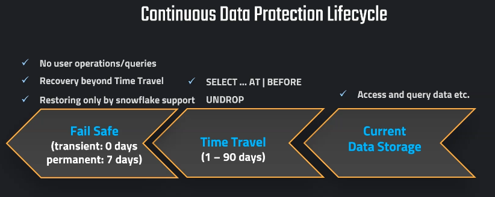

# Performance Optimization in Snowflake

## Key Points to Consider
- **Making Queries Run Faster:** Optimize query performance to reduce execution time.
- **Save Costs:** Efficient resource usage to minimize cost.
- **Automatically Managed Micro-Partitions:** Leverage Snowflake's automatic partitioning for efficient data storage and retrieval.
- **Assigning Appropriate Data Types:** Use the most suitable data types to optimize storage and performance.
- **Sizing Virtual Warehouses:** Right-size virtual warehouses to balance cost and performance.
- **Cluster Keys:** Use cluster keys for better query performance on large tables.

---

## Our Main Objective
Understand the needs of the company and create dedicated virtual warehouses for each group, separating them according to different workloads to optimize performance and cost efficiency.



### Scaling Strategies
- **Scaling Up:** For known patterns of high workloads, scale up the warehouse size to improve performance.
- **Scaling Out (Multi-Clusters):** Dynamically scale out to handle unpredictable workload patterns.

### Maximize Cache Usage
- **Automatic Caching:** Maximize Snowflake's automatic caching to improve query speed.

### Cluster Keys
- Use cluster keys for efficient querying on large tables.

### Dedicated Warehouses
- **Right Size & Type:** Choose the appropriate size and type for each group's workload.
- **Avoid Underutilization:** Correctly classify company needs to prevent underutilization and unnecessary costs.

### Refine Classification
Work patterns may change over time; revisit and refine classifications regularly.

---

## Snowflake SQL Commands
### Create Virtual Warehouses
We specified the creation command, then the name of the warehouse, and last, we define the properties of the warehouse
#### Data Scientists
```sql
CREATE WAREHOUSE DS_WH
  WITH 
  WAREHOUSE_SIZE = 'SMALL'
  WAREHOUSE_TYPE = 'STANDARD'
  AUTO_SUSPEND = 300
  AUTO_RESUME = TRUE
  MIN_CLUSTER_COUNT = 1
  MAX_CLUSTER_COUNT = 1
  SCALING_POLICY = 'STANDARD';
```

#### DBA
```sql
CREATE WAREHOUSE DBA_WH
  WITH 
  WAREHOUSE_SIZE = 'XSMALL'
  WAREHOUSE_TYPE = 'STANDARD'
  AUTO_SUSPEND = 300
  AUTO_RESUME = TRUE
  MIN_CLUSTER_COUNT = 1
  MAX_CLUSTER_COUNT = 1
  SCALING_POLICY = 'STANDARD';
```

### Create Roles and Grant Access
```sql
CREATE ROLE DATA_SCIENTIST;
GRANT USAGE ON WAREHOUSE DS_WH TO ROLE DATA_SCIENTIST;

CREATE ROLE DBA;
GRANT USAGE ON WAREHOUSE DBA_WH TO ROLE DBA;
```

### Setting Up Users
#### Data Scientists
```sql
CREATE USER DS1 PASSWORD = 'DS1' LOGIN_NAME = 'DS1' DEFAULT_ROLE='DATA_SCIENTIST' DEFAULT_WAREHOUSE = 'DS_WH'  MUST_CHANGE_PASSWORD = FALSE;
CREATE USER DS2 PASSWORD = 'DS2' LOGIN_NAME = 'DS2' DEFAULT_ROLE='DATA_SCIENTIST' DEFAULT_WAREHOUSE = 'DS_WH'  MUST_CHANGE_PASSWORD = FALSE;
CREATE USER DS3 PASSWORD = 'DS3' LOGIN_NAME = 'DS3' DEFAULT_ROLE='DATA_SCIENTIST' DEFAULT_WAREHOUSE = 'DS_WH'  MUST_CHANGE_PASSWORD = FALSE;

GRANT ROLE DATA_SCIENTIST TO USER DS1;
GRANT ROLE DATA_SCIENTIST TO USER DS2;
GRANT ROLE DATA_SCIENTIST TO USER DS3;
```

#### DBAs
```sql
CREATE USER DBA1 PASSWORD = 'DBA1' LOGIN_NAME = 'DBA1' DEFAULT_ROLE='DBA' DEFAULT_WAREHOUSE = 'DBA_WH'  MUST_CHANGE_PASSWORD = FALSE;
CREATE USER DBA2 PASSWORD = 'DBA2' LOGIN_NAME = 'DBA2' DEFAULT_ROLE='DBA' DEFAULT_WAREHOUSE = 'DBA_WH'  MUST_CHANGE_PASSWORD = FALSE;

GRANT ROLE DBA TO USER DBA1;
GRANT ROLE DBA TO USER DBA2;
```

### Drop Objects
```sql
DROP USER DBA1;
DROP USER DBA2;

DROP USER DS1;
DROP USER DS2;
DROP USER DS3;

DROP ROLE DATA_SCIENTIST;
DROP ROLE DBA;

DROP WAREHOUSE DS_WH;
DROP WAREHOUSE DBA_WH;
```

---
## Scaling up
- Increasing the size of a virtual warehouses
- More Complex Query
Example how to alter the warehouse properties

```sql
ALTER WAREHOUSE COMPUTE_WH SUSPEND;

ALTER WAREHOUSE COMPUTE_WH RESUME;


ALTER WAREHOUSE COMPUTE_WH
    SET 
        WAREHOUSE_SIZE = 'SMALL',
        MIN_CLUSTER_COUNT = 1,
        MAX_CLUSTER_COUNT = 1,
        SCALING_POLICY = 'STANDARD',
        AUTO_SUSPEND = 600,
        AUTO_RESUME = TRUE;
```

## Increase the size of the warehouse
```sql
ALTER WAREHOUSE COMPUTE_WH
SET WAREHOUSE_SIZE = 'SMALL'

```
# OR use GUI
admin --> warehouses --> select the three dots next to the ware in question and edit

## Scaling out
- Using addition warehouses / Multicluster warehouses
- More Concurrent Users
- Automation the process if you have fluctuation numbers of users

## Use a warehouse with Multicluster and to simulate a high worload the same code in 9 o 10 worksheets
```sql
SELECT * FROM SNOWFLAKE_SAMPLE_DATA.TPCDS_SF100TCL.WEB_SITE T1
CROSS JOIN SNOWFLAKE_SAMPLE_DATA.TPCDS_SF100TCL.WEB_SITE T2
CROSS JOIN SNOWFLAKE_SAMPLE_DATA.TPCDS_SF100TCL.WEB_SITE T3
CROSS JOIN (SELECT TOP 57 * FROM SNOWFLAKE_SAMPLE_DATA.TPCDS_SF100TCL.WEB_SITE)  T4;
```
After go into Admin -->  Warehouse --> You are able to see more than 1 cluster working!!!

## Caching
 Automatically process to speed up the Queries
 query is executed twice , results are cached and can be reused 
 also they are kept fro 24 hours
 the good side about this is that snowflake manage the whole process 

## OUR Job
Ensure that similar queries go on the same warehouse
Example = Team of Data Analyst should be using the same warehouse

## Hands on

```sql
SELECT AVG(C_BIRTH_YEAR) FROM SNOWFLAKE_SAMPLE_DATA.TPCDS_SF100TCL.CUSTOMER
```


- Setting up an additional user
```sql
CREATE ROLE DATA_SCIENTIST;
GRANT USAGE ON WAREHOUSE COMPUTE_WH TO ROLE DATA_SCIENTIST;

CREATE USER DS1 PASSWORD = 'DS1' LOGIN_NAME = 'DS1' DEFAULT_ROLE='DATA_SCIENTIST' DEFAULT_WAREHOUSE = 'DS_WH'  MUST_CHANGE_PASSWORD = FALSE;
GRANT ROLE DATA_SCIENTIST TO USER DS1;
```

# Dont forget to drop them afterwards
```sql
DROP ROLE DATA_SCIENTIST;
DROP USER DS1;
```
## Clustering

Improve the performance 
Subset of rows to locate the data in micro Partitions
For large table this improves the scan efficiency in our queries
Snowflake Automatically maintains these for usage
## What is cluster Key?


Keep in mind that clustering is not for all tables
The one that benefit the most are the ine that have multiple terabites

## How to cluster
Columns that are used most frequently in WHERE-CLAUSES (oftendate columns for event tables)
If yoy typically use filters on two columns the table can also benefit from two cluster keys

# Hands on
- Publicly accessible staging area    
```sql
CREATE OR REPLACE STAGE MANAGE_DB.external_stages.aws_stage
    url='s3://bucketsnowflakes3';
```    

-- List files in stage
```sql
LIST @MANAGE_DB.external_stages.aws_stage;
```

--Load data using copy command

```sql
COPY INTO OUR_FIRST_DB.PUBLIC.ORDERS
    FROM @MANAGE_DB.external_stages.aws_stage
    file_format= (type = csv field_delimiter=',' skip_header=1)
    pattern='.*OrderDetails.*';
```    

    

-- Create table

```sql
CREATE OR REPLACE TABLE ORDERS_CACHING (
ORDER_ID	VARCHAR(30)
,AMOUNT	NUMBER(38,0)
,PROFIT	NUMBER(38,0)
,QUANTITY	NUMBER(38,0)
,CATEGORY	VARCHAR(30)
,SUBCATEGORY	VARCHAR(30)
,DATE DATE)   ; 
```


```sql
INSERT INTO ORDERS_CACHING 
SELECT
t1.ORDER_ID
,t1.AMOUNT	
,t1.PROFIT	
,t1.QUANTITY	
,t1.CATEGORY	
,t1.SUBCATEGORY	
,DATE(UNIFORM(1500000000,1700000000,(RANDOM())))
FROM ORDERS t1
CROSS JOIN (SELECT * FROM ORDERS) t2
CROSS JOIN (SELECT TOP 100 * FROM ORDERS) t3;
```

-- Query Performance before Cluster Key
```sql
SELECT * FROM ORDERS_CACHING  WHERE DATE = '2020-06-09';
```

-- Adding Cluster Key & Compare the result
```sql
ALTER TABLE ORDERS_CACHING CLUSTER BY ( DATE ) ;
```

```sql
SELECT * FROM ORDERS_CACHING  WHERE DATE = '2020-01-05';
```


-- Not ideal clustering & adding a different Cluster Key using function

```sql
SELECT * FROM ORDERS_CACHING  WHERE MONTH(DATE)=11;
```
```sql
ALTER TABLE ORDERS_CACHING CLUSTER BY ( MONTH(DATE) );
```

## Notes
- Copy and paste the above commands directly into Snowflake's query editor.
- Adjust warehouse sizes and scaling policies based on your organization's requirements.


