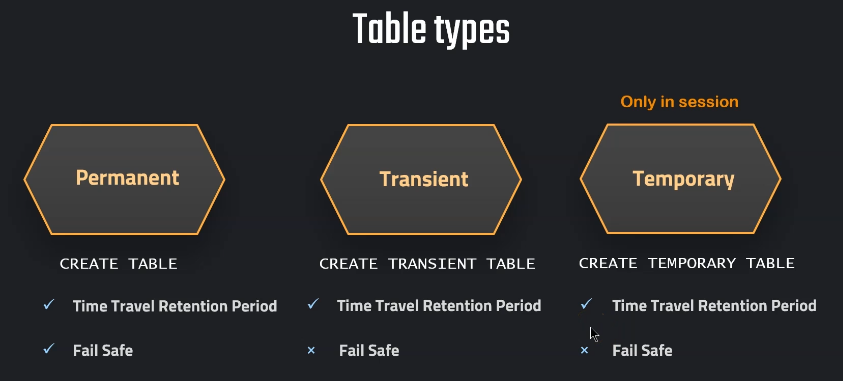

# Snowflake Types of Tables

## Overview
Understanding the different types of tables in Snowflake is essential for effectively managing storage costs and optimizing performance. Snowflake provides three primary types of tables:
- **Permanent Tables**: Standard tables that provide full data retention and Failsafe protection. These tables incur costs for Time Travel and Failsafe storage.
- **Transient Tables**: Similar to permanent tables but without Failsafe. They are useful for intermediate data storage or staging, where long-term recovery is not necessary.
- **Temporary Tables**: These tables exist only for the duration of the session and do not incur Time Travel or Failsafe costs.

By choosing the right type of table based on data usage and retention requirements, organizations can minimize storage costs while ensuring data availability and recovery when needed.

---

## Index
- [Permanent Tables](#permanent-tables)
- [Transient Tables and Schemas](#transient-tables-and-schemas)
- [Temporary Tables and Schemas](#temporary-tables-and-schemas)
- [Conclusion](#conclusion)

---
### Snowflake Types of table



## Permanent Tables and Databases
## Permanent Tables
Permanent tables provide full data retention and Failsafe protection, making them suitable for critical data that requires long-term storage and recovery.

```sql
CREATE OR REPLACE DATABASE PDB;
```
```sql
CREATE OR REPLACE TABLE PDB.public.customers (
  id int,
  first_name string,
  last_name string,
  email string,
  gender string,
  Job string,
  Phone string);
```
```sql  
CREATE OR REPLACE TABLE PDB.public.helper (
  id int,
  first_name string,
  last_name string,
  email string,
  gender string,
  Job string,
  Phone string);
```  
    
### Stage and file format
```sql
CREATE OR REPLACE FILE FORMAT MANAGE_DB.file_formats.csv_file
    type = csv
    field_delimiter = ','
    skip_header = 1
```    
```sql    
CREATE OR REPLACE STAGE MANAGE_DB.external_stages.time_travel_stage
    URL = 's3://data-snowflake-fundamentals/time-travel/'
    file_format = MANAGE_DB.file_formats.csv_file;
```    
```sql    
LIST  @MANAGE_DB.external_stages.time_travel_stage;
```


### Copy data and insert in table
```sql
COPY INTO PDB.public.helper
FROM @MANAGE_DB.external_stages.time_travel_stage
files = ('customers.csv');
```

```sql
SELECT * FROM PDB.public.helper;
```
```sql
INSERT INTO PDB.public.customers
SELECT
t1.ID
,t1.FIRST_NAME	
,t1.LAST_NAME	
,t1.EMAIL	
,t1.GENDER	
,t1.JOB
,t1.PHONE
 FROM PDB.public.helper t1
CROSS JOIN (SELECT * FROM PDB.public.helper) t2
CROSS JOIN (SELECT TOP 100 * FROM PDB.public.helper) t3;
```

-- Show table and validate

```sql
SHOW TABLES;
```

###  Permanent tables
```sql
USE OUR_FIRST_DB
```
```sql
CREATE OR REPLACE TABLE customers (
   id int,
   first_name string,
  last_name string,
  email string,
  gender string,
  Job string,
  Phone string);
```
```sql  
CREATE OR REPLACE DATABASE PDB;
```
```sql
SHOW DATABASES;
```
```sql
SHOW TABLES;
```

###  View table metrics (takes a bit to appear)

```sql
SELECT * FROM SNOWFLAKE.ACCOUNT_USAGE.TABLE_STORAGE_METRICS
```

```sql
SELECT 	ID, 
    TABLE_NAME, 
		TABLE_SCHEMA,
    TABLE_CATALOG,
		ACTIVE_BYTES / (1024*1024*1024) AS ACTIVE_STORAGE_USED_GB,
		TIME_TRAVEL_BYTES / (1024*1024*1024) AS TIME_TRAVEL_STORAGE_USED_GB,
		FAILSAFE_BYTES / (1024*1024*1024) AS FAILSAFE_STORAGE_USED_GB,
        IS_TRANSIENT,
        DELETED,
        TABLE_CREATED,
        TABLE_DROPPED,
        TABLE_ENTERED_FAILSAFE
FROM SNOWFLAKE.ACCOUNT_USAGE.TABLE_STORAGE_METRICS
--WHERE TABLE_CATALOG ='PDB'
WHERE TABLE_DROPPED is not null
ORDER BY FAILSAFE_BYTES DESC;
```

###  Transient Tables and Schemas

--  first option is permanent databases are a kind = trasient table

```sql
CREATE OR REPLACE DATABASE TDB;
```

```sql
CREATE OR REPLACE TRANSIENT TABLE TDB.public.customers_transient (
   id int,
   first_name string,
  last_name string,
  email string,
  gender string,
  Job string,
  Phone string);
```  

```sql
INSERT INTO TDB.public.customers_transient
SELECT t1.* FROM OUR_FIRST_DB.public.customers t1
CROSS JOIN (SELECT * FROM OUR_FIRST_DB.public.customers) t2
```
```sql
SHOW TABLES;
```

### Query storage

```sql
SELECT * FROM SNOWFLAKE.ACCOUNT_USAGE.TABLE_STORAGE_METRICS
```

```sql
SELECT 	ID, 
    TABLE_NAME, 
		TABLE_SCHEMA,
    TABLE_CATALOG,
		ACTIVE_BYTES,
		TIME_TRAVEL_BYTES / (1024*1024*1024) AS TIME_TRAVEL_STORAGE_USED_GB,
		FAILSAFE_BYTES / (1024*1024*1024) AS FAILSAFE_STORAGE_USED_GB,
    IS_TRANSIENT,
    DELETED,
    TABLE_CREATED,
    TABLE_DROPPED,
    TABLE_ENTERED_FAILSAFE
FROM SNOWFLAKE.ACCOUNT_USAGE.TABLE_STORAGE_METRICS
WHERE TABLE_CATALOG ='TDB'
ORDER BY TABLE_CREATED DESC;
```
### Setting Retention Time
###  Set Retention Time to 0 or 1 BEWARE IF you put to cero you will not be able to use undrop
```sql
ALTER TABLE TDB.public.customers_transient
SET DATA_RETENTION_TIME_IN_DAYS  = 1
```
```sql
DROP TABLE TDB.public.customers_transient;
```
```sql
UNDROP TABLE TDB.public.customers_transient;
```
```sql
SHOW TABLES;
```


###  Creating transient schema all the object created inside this schema object will inherit the transient and then table 

```sql
CREATE OR REPLACE TRANSIENT SCHEMA TRANSIENT_SCHEMA;
```
```sql
SHOW SCHEMAS;
```

###  We dont need to specify this is transient automatically do it
```sql
CREATE OR REPLACE TABLE TDB.TRANSIENT_SCHEMA.new_table (
   id int,
   first_name string,
  last_name string,
  email string,
  gender string,
  Job string,
  Phone string);
```
### Setting Retention Time  
### optional intentional error only 1 or 0
```sql
ALTER TABLE TDB.TRANSIENT_SCHEMA.new_table
SET DATA_RETENTION_TIME_IN_DAYS  = 2
```
```sql
SHOW TABLES;
```

###  Temporary Tables and Schemas

-- temporary table is kind like transient table with the distintion that only lives in the current session

```sql
USE DATABASE PDB;
```

--  Create permanent table 

```sql
CREATE OR REPLACE TABLE PDB.public.customers (
   id int,
   first_name string,
  last_name string,
  email string,
  gender string,
  Job string,
  Phone string);
```

```sql
INSERT INTO PDB.public.customers
SELECT t1.* FROM OUR_FIRST_DB.public.customers t1
```
```sql
SELECT * FROM PDB.public.customers
```
```sql
SHOW TABLES;
```

-- Create temporary table (with the same name)this naming will not make a conflict because this temporary table will take charge now of the current session and will live only on the current session

```sql
CREATE OR REPLACE TEMPORARY TABLE PDB.public.customers (
   id int,
   first_name string,
  last_name string,
  email string,
  gender string,
  Job string,
  Phone string);
``` 


-- Validate temporary table is the active table

```sql
SELECT * FROM PDB.public.customers;
```

--  Validate temporary table is the active table

```sql
SHOW TABLES;
```

-- We will put some data to new temporary table
```sql
INSERT INTO PDB.public.customers
SELECT t1.* FROM OUR_FIRST_DB.public.customers t1
```

--  Validate temporary table is the active table with new information
```sql
SELECT * FROM PDB.public.customers;
```


-- Create second temporary table (with a new name)
```sql
CREATE OR REPLACE TEMPORARY TABLE PDB.public.temp_table (
   id int,
   first_name string,
  last_name string,
  email string,
  gender string,
  Job string,
  Phone string);
```
-- Insert data in the new table
```sql
INSERT INTO PDB.public.temp_table
SELECT * FROM PDB.public.customers
```
```sql
SELECT * FROM PDB.public.temp_table
```
```sql
SHOW TABLES;
```

-- Intentionally Error
```sql
CREATE TEMPORARY DATABASE temp;
```
```sql
CREATE TRANSIENT DATABASE temp;
CREATE SCHEMA tempschema;
```
```sql
CREATE OR REPLACE TABLE new_table (
   id int,
   first_name string,
  last_name string,
  email string,
  gender string,
  Job string,
  Phone string);
```
```sql
show schemas;
```
```sql
SHOW TABLES;
```

---

## Conclusion
Understanding Snowflake's table types is crucial for managing storage costs and optimizing performance:
- **Permanent Tables** are ideal for critical data requiring long-term storage and recovery.
- **Transient Tables** are suitable for intermediate or temporary data that does not need Failsafe protection.
- **Temporary Tables** are session-specific and cost-effective for short-lived data processing tasks.

By strategically using the right table type based on data retention requirements, organizations can minimize costs while maintaining data availability and compliance. This approach ensures efficient storage management and cost-effective data processing in Snowflake.

