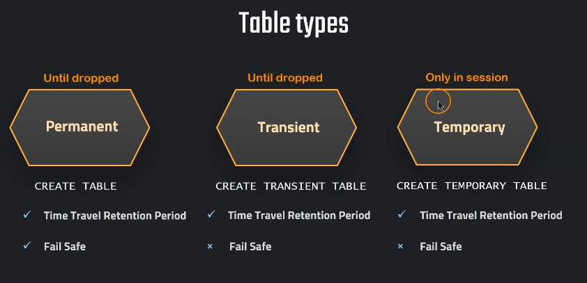

# Snowflake Failsafe

## Overview
Snowflake Failsafe is a data recovery feature designed to protect historical data in the event of a catastrophic failure or disaster. It ensures that data can be recovered even after the Time Travel period has expired. Failsafe is intended as a last-resort recovery option and has the following characteristics:
- **7-day Non-Configurable Period**: The Failsafe period is fixed at 7 days and begins immediately after the Time Travel period ends.
- **No User Interaction**: Data recovery through Failsafe can only be performed by Snowflake support; users do not have direct access to Failsafe data.
- **Storage Costs**: Data stored in Failsafe contributes to overall storage costs.
- **Disaster Recovery**: It is designed for disaster recovery scenarios and should not be relied upon as a standard backup strategy.

Failsafe helps organizations meet compliance and data protection requirements by ensuring data is recoverable in emergency situations.

---
---


---


## Index
- [Failsafe Storage Hands On](#failsafe-storage-hands-on)
  - [Interface Configuration](#interface-configuration)
  - [Account Level Storage Usage](#account-level-storage-usage)
  - [Table Level Storage Usage](#table-level-storage-usage)
- [Conclusion](#conclusion)

---

## Failsafe Storage Hands On

### Interface Configuration
1. Go to **Snowflake Console** → **Admin** → **Cost Management** → **Consumption**.
2. Apply the following filters to the graphs:
    - **Use Type**: Select **Storage**
    - **Group By**: Choose **Type**

---

### Account Level Storage Usage
This query provides an overview of storage usage at the account level, broken down by type, including Failsafe.
```sql
SELECT * FROM SNOWFLAKE.ACCOUNT_USAGE.STORAGE_USAGE ORDER BY USAGE_DATE DESC;
```

To see the storage usage formatted in gigabytes, including Failsafe storage:
```sql
SELECT  USAGE_DATE,
        STORAGE_BYTES / (1024*1024*1024) AS STORAGE_GB,  
        STAGE_BYTES / (1024*1024*1024) AS STAGE_GB,
        FAILSAFE_BYTES / (1024*1024*1024) AS FAILSAFE_GB
FROM SNOWFLAKE.ACCOUNT_USAGE.STORAGE_USAGE ORDER BY USAGE_DATE DESC;
```

---

### Table Level Storage Usage
This query displays detailed storage usage at the table level:
```sql
SELECT * FROM SNOWFLAKE.ACCOUNT_USAGE.TABLE_STORAGE_METRICS;
```

To view storage usage by table in gigabytes, including how much is consumed by Failsafe:
```sql
SELECT  ID,
        TABLE_NAME,
        TABLE_SCHEMA,
        ACTIVE_BYTES / (1024*1024*1024) AS STORAGE_USED_GB,
        TIME_TRAVEL_BYTES / (1024*1024*1024) AS TIME_TRAVEL_STORAGE_USED_GB,
        FAILSAFE_BYTES / (1024*1024*1024) AS FAILSAFE_STORAGE_USED_GB
FROM SNOWFLAKE.ACCOUNT_USAGE.TABLE_STORAGE_METRICS
ORDER BY FAILSAFE_STORAGE_USED_GB DESC;
```

---

## Conclusion
Snowflake Failsafe provides an additional layer of protection by preserving historical data for 7 days after the Time Travel period ends. Although it is non-configurable and accessible only by Snowflake support, it serves as a critical safeguard against catastrophic data loss. Failsafe is not meant for regular data recovery but is designed for disaster recovery scenarios. By understanding how Failsafe contributes to storage costs and how to monitor its usage, organizations can better manage their Snowflake data storage strategy while ensuring compliance and data protection.

Failsafe complements Time Travel and together, they offer robust data protection and recovery options in Snowflake.

